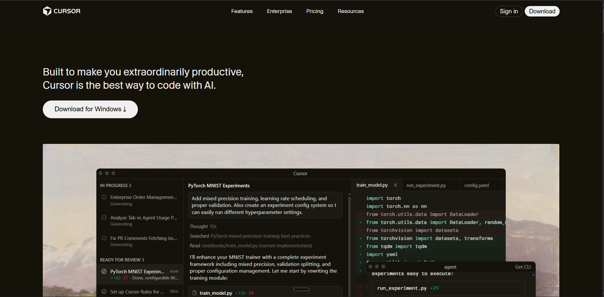

# Cursor Landing Page

Landing page for Cursor built with basic HTML and CSS. Built as part of the ChaiCode WebDev 2026 cohort.

## Live Demo

Check out the live version here: [https://cursorlanding.vercel.app/](https://cursorlanding.vercel.app/)



## Design System

#### Colors Used
- **Primary Background:** `#15120a` - Main dark background
- **Secondary Background:** `#1a1813` - Card and section backgrounds  
- **Tertiary Background:** `#211f18` - Highlight cards background
- **Navbar Background:** `#14120b` - Navigation bar background
- **Primary Text:** `#EDECEC` - Main text color
- **Secondary Text:** `#999896` - Muted descriptive text
- **Tertiary Text:** `#8b9191` - Meta information and timestamps
- **Light Text:** `#ccc` - Hover states for links
- **Accent/Link Color:** `#e2400b` - Call-to-action links and important actions
- **Border Color:** `rgba(255, 255, 255, 0.2)` - Subtle borders on buttons
- **Hover States:** 
  - `#22201a` - Sign-in button hover
  - `#d7d7d7` - Download/CTA button hover
  - `#27251d` - Highlight card hover
  - `#292720` - Footer button hover

#### Typography
- **Primary Font:** Custom fonts from `assets/fonts/`

## Sections Recreated

This landing page faithfully recreates all the sections from the original Cursor website.
Each section was built from scratch using semantic HTML and custom CSS, maintaining visual fidelity to the original design while ensuring responsive behavior across all devices.

## Installation & Setup

### Prerequisites
- Any web browser
- Git installed on your system
- Any IDE
- Live Server extension (optional, for local development & Smooth Workflow)

### Clone the Repository

```bash
git clone https://github.com/Ritam369/Cursor_Landing.git
cd Cursor_Landing
```

### Run Locally

**Option 1: Using Live Server (Recommended)**
- Install [Live Server](https://marketplace.visualstudio.com/items?itemName=ritwickdey.LiveServer) extension in VS Code
- Right-click on `index.html` and select "Open with Live Server"

**Option 2: Direct Browser Opening**
- Simply double-click `index.html` to open it in your default browser

---
